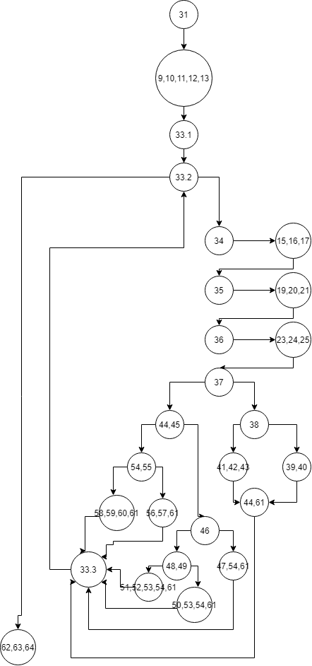
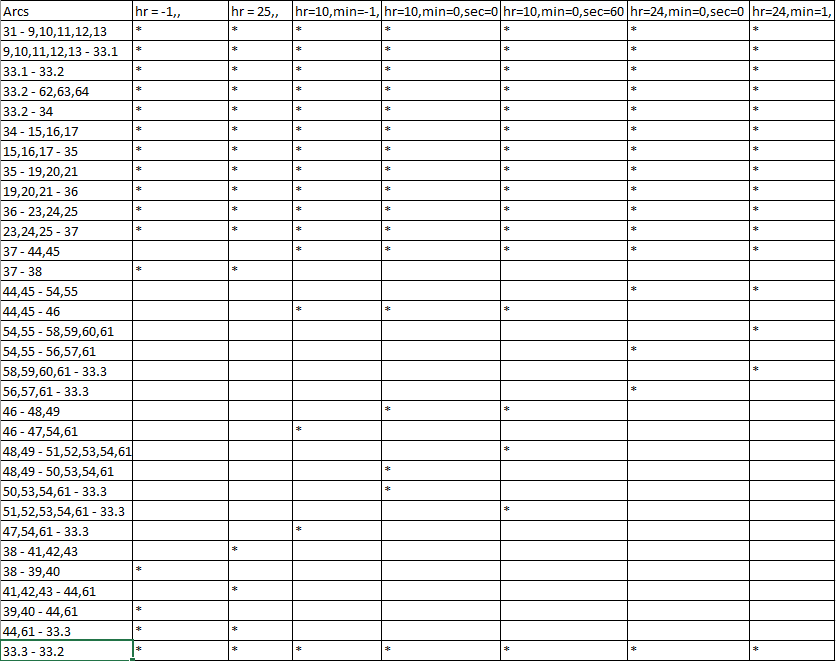
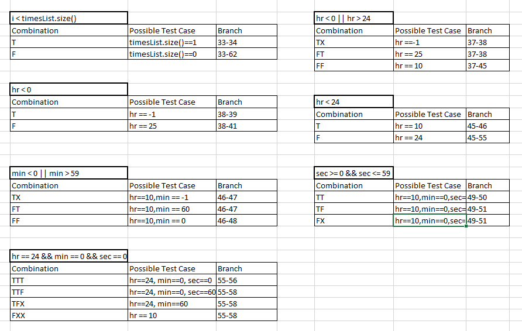

# Втора лабораториска вежба по Софтверско инженерство

## Никола Анастасовски, бр. на индекс 195012

### Група на код: 

Ја добив групата на код 5

###  Control Flow Graph

### Every branch

### Multiple Condition

### Цикломатска комплексност

Цикломатската комплексност на овој код е 8, истата ја добив преку формулата P+1, каде што P е бројот на предикатни јазли. Во случајoв P=7, па цикломатската комплексност изнесува 8. Предикатни јазли((33.2), (37), (38), (44,45), (54,55), (46), (48,49)) 

### Тест случаи според критериумот  Every branch 

    @Test
    public void test1() {
        //Every branch / Multiple Condition (i < timesList.size()) T, (hr < 0 || hr > 24) TX
        //Multiple Condition (hr < 0) T
        Time time = new Time(-1,30,30);
        List<Time> TimesList = new ArrayList<>();
        TimesList.add(time);
        try {
            SILab2.function(TimesList);
        } catch (Exception e){
            assertEquals(e.getMessage(),"The hours are smaller than the minimum");
        }
    }

    @Test
    public void test2() {
        //Every branch / Multiple Condition (hr < 0 || hr > 24) FT
        //Multiple Condition (hr < 0) F
        Time Time = new Time(25,30,30);
        List<Time> TimesList = new ArrayList<>();
        TimesList.add(Time);
        try {
            SILab2.function(TimesList);
        } catch (Exception e){
            assertEquals(e.getMessage(),"The hours are grater than the maximum");
        }
    }

    @Test
    public void test3() {
        //Every branch / Multiple Condition (hr < 0 || hr > 24) FF
        // Multiple Condition (hr < 24) T, (min < 0 || min > 59) TX
        //Multiple condition (min<0 || min>59) FT
        Time Time = new Time(10,-1,0);
        Time Time2 = new Time(10,60,60);
        List<Time> TimesList = new ArrayList<>();
        TimesList.add(Time);
        TimesList.add(Time2);
        try {
            SILab2.function(TimesList);
        } catch (Exception e){
            assertEquals(e.getMessage(),"The minutes are not valid!");
        }
    }

    @Test
    public void test4() {
        //Every branch / Multiple Condition (min < 0 || min > 59) FF
        // Multiple Condition (sec >= 0 && sec <= 59) TT
        Time Time = new Time(10,0,0);
        List<Time> TimesList = new ArrayList<>();
        List<Integer> result = new ArrayList<>();
        TimesList.add(Time);
        result = SILab2.function(TimesList);
        assertEquals(result.get(0).intValue(),Time.getHours()*3600 + Time.getMinutes()*60 + Time.getSeconds());
    }

    @Test
    public void test5() {
        //Every branch / Multiple Condition (sec >= 0 && sec <= 59) TF
        // Multiple Condition (hr == 24 && min == 0 && sec == 0) FXX
        //Multiple condition (sec >= 0 && sec <= 59) FX
        Time Time = new Time(10,0,60);
        Time Time2 = new Time(10,0,-1);
        List<Time> TimesList = new ArrayList<>();
        TimesList.add(Time);
        TimesList.add(Time2);
        try {
            SILab2.function(TimesList);
        } catch (Exception e){
            assertEquals(e.getMessage(),"The seconds are not valid");
        }
    }

    @Test
    public void test6() {
        //Every branch / Multiple Condition (hr < 24) F
        // Multiple Condition (hr == 24 && min == 0 && sec == 0) TTT
        Time Time = new Time(24,0,0); 
        List<Time> TimesList = new ArrayList<>();
        List<Integer> result = new ArrayList<>();
        TimesList.add(Time);
        result = SILab2.function(TimesList);
        assertEquals(result.get(0).intValue(),Time.getHours()*3600 + Time.getMinutes()*60 + Time.getSeconds());
    }

    @Test
    public void test7() {
        //Every branch / Multiple condition (hr == 24 && min == 0 && sec == 0) TTF, 
        //(hr == 24 && min == 0 && sec == 0) TFX
        Time Time = new Time(24,1,0);
        Time Time3 = new Time(24,0,60);
        Time Time2 = new Time(24,60,-1);
        List<Time> TimesList = new ArrayList<>();
        TimesList.add(Time);
        TimesList.add(Time3);
        TimesList.add(Time2);
        try {
            SILab2.function(TimesList);
        } catch (Exception e){
            assertEquals(e.getMessage(),"The time is greater than the maximum");
        }
    }

### Тест случаи според критериумот Multiple condition

    @Test
    public void test1() {
        //Every branch / Multiple Condition (i < timesList.size()) T, (hr < 0 || hr > 24) TX
        //Multiple Condition (hr < 0) T
        Time time = new Time(-1,30,30);
        List<Time> TimesList = new ArrayList<>();
        TimesList.add(time);
        try {
            SILab2.function(TimesList);
        } catch (Exception e){
            assertEquals(e.getMessage(),"The hours are smaller than the minimum");
        }
    }

    @Test
    public void test2() {
        //Every branch / Multiple Condition (hr < 0 || hr > 24) FT
        //Multiple Condition (hr < 0) F
        Time Time = new Time(25,30,30);
        List<Time> TimesList = new ArrayList<>();
        TimesList.add(Time);
        try {
            SILab2.function(TimesList);
        } catch (Exception e){
            assertEquals(e.getMessage(),"The hours are grater than the maximum");
        }
    }

    @Test
    public void test3() {
        //Every branch / Multiple Condition (hr < 0 || hr > 24) FF
        // Multiple Condition (hr < 24) T, (min < 0 || min > 59) TX
        //Multiple condition (min<0 || min>59) FT
        Time Time = new Time(10,-1,0);
        Time Time2 = new Time(10,60,60);
        List<Time> TimesList = new ArrayList<>();
        TimesList.add(Time);
        TimesList.add(Time2);
        try {
            SILab2.function(TimesList);
        } catch (Exception e){
            assertEquals(e.getMessage(),"The minutes are not valid!");
        }
    }

    @Test
    public void test4() {
        //Every branch / Multiple Condition (min < 0 || min > 59) FF
        // Multiple Condition (sec >= 0 && sec <= 59) TT
        Time Time = new Time(10,0,0);
        List<Time> TimesList = new ArrayList<>();
        List<Integer> result = new ArrayList<>();
        TimesList.add(Time);
        result = SILab2.function(TimesList);
        assertEquals(result.get(0).intValue(),Time.getHours()*3600 + Time.getMinutes()*60 + Time.getSeconds());
    }

    @Test
    public void test5() {
        //Every branch / Multiple Condition (sec >= 0 && sec <= 59) TF
        // Multiple Condition (hr == 24 && min == 0 && sec == 0) FXX
        //Multiple condition (sec >= 0 && sec <= 59) FX
        Time Time = new Time(10,0,60);
        Time Time2 = new Time(10,0,-1);
        List<Time> TimesList = new ArrayList<>();
        TimesList.add(Time);
        TimesList.add(Time2);
        try {
            SILab2.function(TimesList);
        } catch (Exception e){
            assertEquals(e.getMessage(),"The seconds are not valid");
        }
    }

    @Test
    public void test6() {
        //Every branch / Multiple Condition (hr < 24) F
        // Multiple Condition (hr == 24 && min == 0 && sec == 0) TTT
        Time Time = new Time(24,0,0); 
        List<Time> TimesList = new ArrayList<>();
        List<Integer> result = new ArrayList<>();
        TimesList.add(Time);
        result = SILab2.function(TimesList);
        assertEquals(result.get(0).intValue(),Time.getHours()*3600 + Time.getMinutes()*60 + Time.getSeconds());
    }

    @Test
    public void test7() {
        //Every branch / Multiple condition (hr == 24 && min == 0 && sec == 0) TTF, 
        //(hr == 24 && min == 0 && sec == 0) TFX
        Time Time = new Time(24,1,0);
        Time Time3 = new Time(24,0,60);
        Time Time2 = new Time(24,60,-1);
        List<Time> TimesList = new ArrayList<>();
        TimesList.add(Time);
        TimesList.add(Time3);
        TimesList.add(Time2);
        try {
            SILab2.function(TimesList);
        } catch (Exception e){
            assertEquals(e.getMessage(),"The time is greater than the maximum");
        }
    }
    @Test
    public void test8() {
        //Multiple condition (i < timesList.size()) F
        List<Time> TimesList = new ArrayList<>();
        List<Integer> result = new ArrayList<>();
        result = SILab2.function(TimesList);
        assertEquals(result.size(),0);
    }

### Објаснување на напишаните unit tests

##### Тестови според критериумот Every branch

##### Тест 1:

Се тестираат бренчовите: 31 - 9,10,11,12,13 / 9,10,11,12,13 - 33.1 / 33.1 - 33.2 / 33.2 - 62,63,64 / 33.2 - 34 / 34 - 15,16,17 / 15,16,17 - 35 / 35 - 19,20,21 / 19,20,21 - 36 / 36 - 23,24,25 / 23,24,25 - 37 / 37 - 38 / 38 - 39,40 / 39,40 - 44,61 / 44,61 - 33.3 / 33.3 - 33.2.

##### Тест 2:

Се тестираат бренчовите: 31 - 9,10,11,12,13 / 9,10,11,12,13 - 33.1 / 33.1 - 33.2 / 33.2 - 62,63,64 / 33.2 - 34 / 34 - 15,16,17 / 15,16,17 - 35 / 35 - 19,20,21 / 19,20,21 - 36 / 36 - 23,24,25 / 23,24,25 - 37 / 37 - 38 / 38 - 41,42,43 / 41,42,43 - 44,61 / 44,61 - 33.3 / 33.3 - 33.2.

##### Тест 3:

Се тестираат бренчовите: 31 - 9,10,11,12,13 / 9,10,11,12,13 - 33.1 / 33.1 - 33.2 / 33.2 - 62,63,64 / 33.2 - 34 / 34 - 15,16,17 / 15,16,17 - 35 / 35 - 19,20,21 / 19,20,21 - 36 / 36 - 23,24,25 / 23,24,25 - 37 / 37 - 44,45 / 44,45 - 46 / 46 - 47,54,61 / 47,54,61 - 33.3 / 33.3 - 33.2.

##### Тест 4:

Се тестираат бренчовите: 31 - 9,10,11,12,13 / 9,10,11,12,13 - 33.1 / 33.1 - 33.2 / 33.2 - 62,63,64 / 33.2 - 34 / 34 - 15,16,17 / 15,16,17 - 35 / 35 - 19,20,21 / 19,20,21 - 36 / 36 - 23,24,25 / 23,24,25 - 37 / 37 - 44,45 / 44,45 - 46 / 46 - 48,49 / 48,49 - 50,53,54,61 / 50,53,54,61 - 33.3 / 33.3 - 33.2.

##### Тест 5:

Се тестираат бренчовите: 31 - 9,10,11,12,13 / 9,10,11,12,13 - 33.1 / 33.1 - 33.2 / 33.2 - 62,63,64 / 33.2 - 34 / 34 - 15,16,17 / 15,16,17 - 35 / 35 - 19,20,21 / 19,20,21 - 36 / 36 - 23,24,25 / 23,24,25 - 37 / 37 - 44,45 / 44,45 - 46 / 46 - 48,49 / 48,49 - 51,52,53,54,61 / 51,52,53,54,61 - 33.3 / 33.3 - 33.2.

##### Тест 6:

Се тестираат бренчовите: 31 - 9,10,11,12,13 / 9,10,11,12,13 - 33.1 / 33.1 - 33.2 / 33.2 - 62,63,64 / 33.2 - 34 / 34 - 15,16,17 / 15,16,17 - 35 / 35 - 19,20,21 / 19,20,21 - 36 / 36 - 23,24,25 / 23,24,25 - 37 / 37 - 44,45 / 44,45 - 54,55 / 54,55 - 56,57,61 / 56,57,61 - 33.3 / 33.3 - 33.2.

##### Тест 7:

Се тестираат бренчовите: 31 - 9,10,11,12,13 / 9,10,11,12,13 - 33.1 / 33.1 - 33.2 / 33.2 - 62,63,64 / 33.2 - 34 / 34 - 15,16,17 / 15,16,17 - 35 / 35 - 19,20,21 / 19,20,21 - 36 / 36 - 23,24,25 / 23,24,25 - 37 / 37 - 44,45 / 44,45 - 54,55 / 54,55 - 58,59,60,61 / 58,59,60,61 - 33.3 / 33.3 - 33.2.

##### Тестови според критериумот Multiple condition

##### Тест 1:

Се тестира: (i < timesList.size()) кога е T, (hr < 0 || hr > 24) кога е TX, (hr < 0) кога е T.

##### Тест 2:

Се тестира: (hr < 0 || hr > 24) кога е FT, (hr < 0) кога е F.

##### Тест 3:

Се тестира: (hr < 0 || hr > 24) кога е FF, (hr < 24) кога е T, (min < 0 || min > 59) кога е TX, (min<0 || min>59) кога е FT.

##### Тест 4:

Се тестира: (min < 0 || min > 59) кога е FF, (sec >= 0 && sec <= 59) кога е TT.

##### Тест 5:

Се тестира: (sec >= 0 && sec <= 59) кога е TF, (hr == 24 && min == 0 && sec == 0) кога е FXX, (sec >= 0 && sec <= 59) кога е FX.

##### Тест 6:

Се тестира: (hr < 24) кога е F, (hr == 24 && min == 0 && sec == 0) кога е TTT.

##### Тест 7:

Се тестира: (hr == 24 && min == 0 && sec == 0) кога е TTF,(hr == 24 && min == 0 && sec == 0) кога е TFX.

##### Тест 8:

Се тестира: (i < timesList.size()) кога е F.